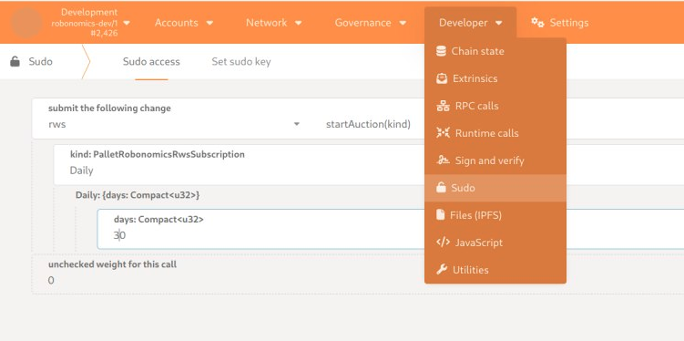
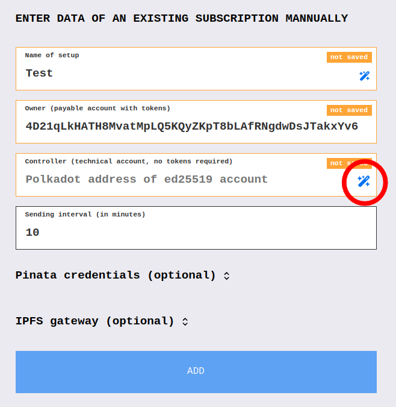
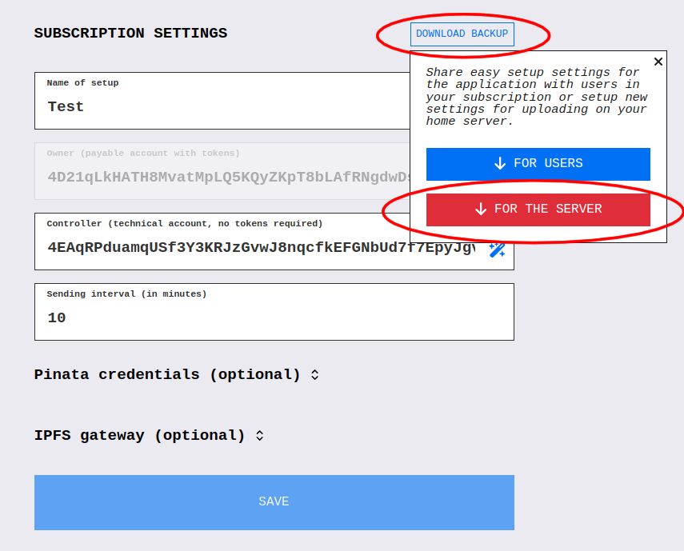
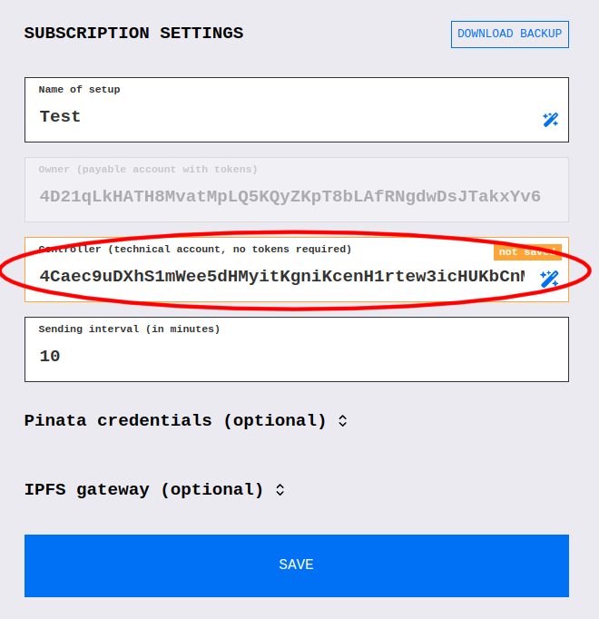
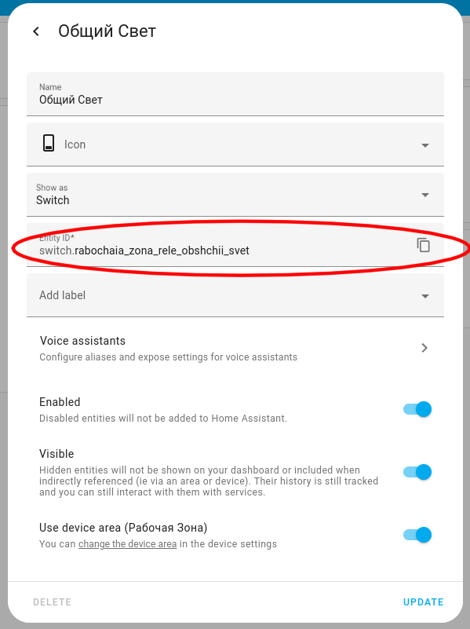
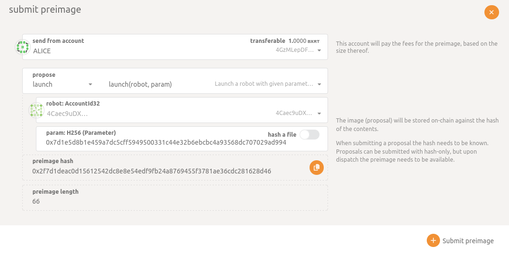
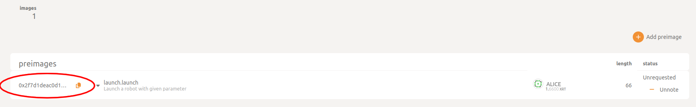

# Hackaton Readme

## Install Home Assistant

1. Install smart home server on the Raspberry Pi using [this instruction](https://wiki.robonomics.network/docs/install-smart-home/#hardware-you-need-for-installation).
2. Connect some devices to control. You can use [real devices](https://wiki.robonomics.network/docs/zigbee-devices/) or [virtual](https://wiki.robonomics.network/docs/virtual-devices/).

## Run Robonomics node

1. Clone the Robonomics fork on your computer
```bash
git clone https://github.com/nakata5321/robonomics.git
cd robonomics
git checkout hackaton
```

2. Install rust and required packages
```bash
curl https://sh.rustup.rs -sSf | sh
rustup target add wasm32-unknown-unknown --toolchain nightly
sudo apt install cmake git clang libclang-dev protobuf-compiler
```

3. Build the node:
```bash
cargo build
```

4. Run it
```bash
robonomics --dev  --rpc-external --tmp
```

## Create Accounts and buy RWS

1. On Polkadot portal connect to the dev node using [this instruction](https://wiki.robonomics.network/docs/run-dev-node/#connect).

2. Create RWS on `Developer / Sudo` tab choose `rws / startAuction` with the following parameters



3. Buy the subscription using [this instruction](https://wiki.robonomics.network/docs/get-subscription/)

4. On [Robonomics App](https://robonomics.app/#/rws-setup) add the address of your Owner account and press on the magic button to generate controller account.



After that press `Add`

5. Now you can see `Download Backup` button, press it and choose `For the Server`. It will regenerate the controller account, and download the setup file for Robonomics Integration, don't loose it and don't forget the password you used.



6. Save somewhere the controller address you currently have



7. On Polkadot portal add the controller address to the RWS using the end of [this instruction](https://wiki.robonomics.network/docs/run-dev-node/#connect).

## Install Robonomics Integration Fork

1. On your Raspberry Pi clone the repo
```bash
git clone https://github.com/nakata5321/homeassistant-robonomics-integration.git
cd homeassistant-robonomics-integration
git checkout hackaton
```
2. Copy integration folder to the Home Assistant config folder
```bash
sudo rm -r ~/home-assistant-web3-build/homeassistant/custom_components/robonomics
cp -r ~/homeassistant-robonomics-integration/custom_components/robonomics ~/home-assistant-web3-build/homeassistant/custom_components/robonomics
```
3. And restart Home Assistant
```bash
docker restart homeassistant
```

## Setup Robonomics Integration

1. In the web interface of Home Assistant go to `Settings -> Device & Services` and press `ADD INTEGRATION`. Search for Robonomics.

2. Upload the setup file you got on the previous steps and write the password.

## Create Command to Control your Device

1. In the Home Assitant dashboard press on your device and then on settings button. Here you can find entity id of your device, save it.



2. On the Raspberry Pi go inside the IPFS container
```bash
docker exec -ti ipfs-daemon sh
```

3. Save the command to the file. Change the entity_id value.
```bash
echo `{"platform":"switch","name":"turn_on","params":{"entity_id":"switch.rabochaia_zona_rele_obshchii_svet"}}` >> command.txt
```

4. Add the file to the IPFS local node
```bash
ipfs add commant.txt
```
You will get the IPFS cid like this `QmWm4XXLMMCFKuzwSqemSKB1N7AY1xYMSagPP5ajg5Uzju`.

5. Using [robonomics-interface](https://pypi.org/project/robonomics-interface/) python package encode this IPFS cid
```python
>>> from robonomicsinterface.utils import ipfs_qm_hash_to_32_bytes
>>> ipfs_qm_hash_to_32_bytes("QmWm4XXLMMCFKuzwSqemSKB1N7AY1xYMSagPP5ajg5Uzju")
'0x7d1e5d8b1e459a7dc5cff5949500331c44e32b6ebcbc4a93568dc707029ad994'
```

## Send Democracy Launch Command

1. On polkadot Portal go to `Governance / Preimages` tab and press `Add image`. Fill in the fields like in the picture



where `robot` is your controller address and `param` is encoded IPFS cid from the previous step.

2. Save preimage hash



3. On the `Governance / Democracy` tab press on `Submit Proposal` and paste the preimage hash.

4. Vote for the execution

After sending the launch command, your device should turn on.